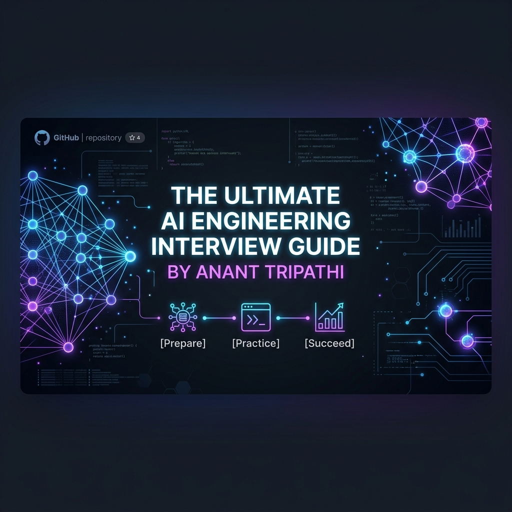

  
  
  # The Ultimate AI Engineering Interview Guide
  
  
  
  

  
The definitive interview preparation cheat sheet for modern AI Engineering roles. Extensively covering Foundation Models, Retrieval-Augmented Generation (RAG), Agentic AI, LLMOps, infrastructure scaling, and multimodal systems.

> **Roles this guide is curated for:** AI Engineer • GenAI Engineer • LLM Engineer • Agentic AI Engineer • AI Solutions Architect • AI Platform Engineer • MLOps/LLMOps Engineer

## 📌 Table of Contents

* [1. Core Must-Know Concepts](#1-core-must-know-concepts)
* [2. LLM Fundamentals & Architecture](#2-llm-fundamentals--architecture)
* [3. Prompt Engineering & Optimization](#3-prompt-engineering--optimization)
* [4. Retrieval-Augmented Generation (RAG)](#4-retrieval-augmented-generation-rag)
* [5. AI Agents & Agentic Systems](#5-ai-agents--agentic-systems)
* [6. Vector Databases & Embeddings](#6-vector-databases--embeddings)
* [7. Fine-Tuning & Model Alignment](#7-fine-tuning--model-alignment)
* [8. AI System Design](#8-ai-system-design)
* [9. Production AI & LLMOps](#9-production-ai--llmops)
* [10. Evaluation & Benchmarking](#10-evaluation--benchmarking)
* [11. AI Infrastructure & Scalability](#11-ai-infrastructure--scalability)
* [12. Multi-Modal AI](#12-multi-modal-ai)
* [13. AI Safety, Ethics & Security](#13-ai-safety-ethics--security)
* [14. Coding & Practical Implementation](#14-coding--practical-implementation)
* [15. Behavioral & Scenario-Based Questions](#15-behavioral--scenario-based-questions)

---

## 1. Core Must-Know Concepts
*Begin your preparation by mastering these absolute fundamentals.*

- **LLM Context:** Standard pre-training vs. Instruction pre-training algorithms.
- **RAG Architecture:** The baseline components (Embed -> Retrieve -> Generate).
- **Tool Use & Function Calling:** Enabling deterministic actions via LLMs.
- **MCP (Model Context Protocol):** Standardizing communication between foundation models and external tools.
- **Agentic Workflows:** Loops, reflection, and multi-agent coordination.
- **PEFT / LoRA:** Parameter-Efficient Fine-Tuning basics.
- **Quantization:** Moving from FP16 to INT8/INT4 for reduced memory footprint.

## 2. LLM Fundamentals & Architecture
*Deep dives into how Transformers actually work under the hood.*

- What are foundation models, and how do they differ from task-specific ML models?
- Break down the Transformer architecture: Encoders, Decoders, and Attention Mechanisms.
- Explain tokenization (BPE, WordPiece, SentencePiece). How can tokenization negatively impact code generation or mathematical reasoning?
- What are positional embeddings? Compare absolute, relative, and Rotary Position Embeddings (RoPE).
- Explain the Query (Q), Key (K), and Value (V) matrices in self-attention.
- Why is the attention dot product scaled by $\sqrt{d_k}$?
- Explain causal masking and why it's critical for auto-regressive generation.
- Detail the purpose of Multi-Head Attention (MHA) vs. Grouped-Query Attention (GQA) vs. Multi-Query Attention (MQA).
- What is the KV Cache? Explain PagedAttention and how it mitigates memory bottlenecks during sequence generation.
- What are logits? How do `temperature`, `top-k`, and `top-p` (nucleus) sampling actually manipulate the logic distribution?
- What is a Mixture of Experts (MoE) architecture? Compare dense vs. sparse models.
- **Scenario:** Your LLM is generating text that repeats phrases in long outputs (like "As an AI language model..."). How do you penalize repetition mathematically?

## 3. Prompt Engineering & Optimization
*Controlling model behaviour through sophisticated input shaping.*

- Contrast zero-shot, one-shot, and few-shot prompting. When does few-shot fail?
- What is Chain-of-Thought (CoT) prompting? How does it differ from Tree-of-Thoughts (ToT) or multi-path reasoning?
- What is ReAct (Reasoning + Acting) prompting?
- How do you engineer prompts for reliable structured JSON generation? (e.g., using schemas, XML tags, or strict grammar).
- What is the "Lost in the Middle" phenomenon, and how do you mitigate it when writing long prompts?
- Explain Prompt Caching. How does it save costs on repetitive long-context tasks?
- **Scenario:** You are hitting context window limits aggressively. How do you summarize or partition the prompt context dynamically?
- **Scenario:** Your Few-Shot examples cause the LLM to overfit on the format, resulting in rigid answers. How do you increase variance?

## 4. Retrieval-Augmented Generation (RAG)
*Mastering dynamic knowledge injection.*

- Explain the end-to-end architecture of a production-grade Chunk-and-Embed RAG pipeline.
- Detail text chunking strategies: fixed-size, recursive, semantic, and parent-child chunking.
- What is Hybrid Search? Explain how BM25 (sparse) and Vector Search (dense) are combined via Reciprocal Rank Fusion (RRF).
- Why is Re-ranking (Cross-Encoders or Cohere Rerank) necessary after initial retrieval?
- What is Query Transformation? Explain the steps of Query Expansion, Multi-Query formulation, and Step-Back Prompting.
- What is Self-RAG/Corrective RAG (CRAG) and how does it grade the quality of its own retrieved context?
- Explain Graph RAG and Knowledge Graphs. When should you use Graph RAG over dense vector RAG?
- **Scenario:** Your enterprise RAG system returns contradictory answers from different HR policies in the vector DB. How do you resolve info conflicts?
- **Scenario:** RAG retrieval is extremely slow for a database of 1M+ embeddings. How do you index the data to speed this up?

## 5. AI Agents & Agentic Systems
*Building autonomous, reasoning software layers.*

- What defines an AI Agent versus an LLM prompt chain?
- Explain the Plan-and-Execute agent framework.
- Deep dive into OpenAI's Function Calling: How does the model mathematically know when to emit a tool call vs text?
- Describe multi-agent setups (e.g., LangGraph, AutoGen, CrewAI). When is a supervisor/worker hierarchy better than a flat architecture?
- What are the types of agent memory? (Episodic, Semantic, Working/Short-term).
- What is DSPy and how does it approach prompt optimization computationally compared to manual engineering?
- **Scenario:** Your agent enters an infinite loop, continuously calling a search tool with the exact same query. How do you implement circuit breakers?
- **Scenario:** An autonomous data-cleaning agent executed a `DROP TABLE` command. How do you architect human-in-the-loop (HitL) execution environments?

## 6. Vector Databases & Embeddings
*Handling high-dimensional data representation.*

- What are semantic embeddings? Differentiate between sparse embeddings (SPLADE) and dense embeddings.
- Which distant metrics apply to vector search? (Cosine Similarity, Euclidean Distance L2, Dot Product).
- How do Vector Databases scale? Explain the HNSW (Hierarchical Navigable Small World) algorithm.
- Describe Product Quantization (PQ) and how it compresses vector footprint.
- Explain the necessity of Metadata Filtering (pre-filtering vs. post-filtering) in Vector DBs.
- **Scenario:** You swapped embedding models from `text-embedding-ada-002` to `text-embedding-3-small`. How do you migrate a database of 10M vectors with zero downtime?

## 7. Fine-Tuning & Model Alignment
*Adapting weights to domain-specific knowledge.*

- Provide a decision matrix on when to use: Prompt Engineering vs. RAG vs. Fine-Tuning vs. Pre-training from scratch.
- Explain Supervised Fine-Tuning (SFT) and dataset curation.
- What is LoRA (Low-Rank Adaptation)? Explain the math of freezing base weights and training factorized matrices $A$ and $B$.
- What is catastrophic forgetting and how does regularized fine-tuning mitigate it?
- Explain RLHF (Reinforcement Learning from Human Feedback). Walk through the Reward Model phase and the PPO (Proximal Policy Optimization) phase.
- What is DPO (Direct Preference Optimization) and why has it become more popular than classical RLHF?
- **Scenario:** Your fine-tuned LLM suddenly forgot general reasoning capabilities while excelling at your domain task. How do you fix it?

## 8. AI System Design
*Architecting real-world generative applications.*

- Design a live AI Coding Assistant (Copilot clone). Address latency, IDE context fetching, ghost-text streaming, and code completion algorithms.
- Design an Enterprise Knowledge Assistant across millions of access-controlled permissions (Slack, G-Drive, Jira).
- Design a real-time Fraud Detection system passing logs through rapid classification LLMs.
- Design an asynchronous batch orchestration system parsing 100-page financial PDFs into structured JSON overnight.
- Design a conversational AI orchestrator using a Router architecture: Routing simple queries to smaller models and complex queries to larger models to save cost.
- Explain rate-limiting, cost-monitoring, and multi-tenant isolation patterns for GenAI gateways.

## 9. Production AI & LLMOps
*Deploying and maintaining AI systems stably.*

- What is the difference between traditional MLOps and LLMOps?
- How do you manage API Key rotation, Secrets, and Enterprise Gateways for OpenAI/Anthropic APIs?
- Explain the CI/CD lifecycle for an update to a prompt template. How do you test it before deploying?
- What observability metrics are strictly necessary for an LLM pipeline? (TTFT, Inter-token Latency, Cost per Request).
- Describe tracing tools (LangSmith, Phoenix). Why is span tracing critical for multi-stage Agentic chains?
- What are Model Drift and Data Drift in the context of frozen foundational models?
- **Scenario:** Peak traffic hits your LLM endpoint. How do you manage continuous batching and queuing gracefully?

## 10. Evaluation & Benchmarking
*Proving your AI actually works.*

- Contrast lexical metrics (BLEU, ROUGE) with semantic metrics (BERTScore). Why are older metrics inadequate for LLMs?
- Explain the `LLM-as-a-judge` concept. What biases does it introduce? (Position bias, verbosity bias).
- What are faithfulness and answer relevance in RAG evaluation? Describe the `RAGAS` framework.
- What is G-Eval?
- Discuss the purpose of MMLU, HumanEval, and LMSYS Chatbot Arena ELO ratings.
- **Scenario:** Two different evaluators (one human, one LLM) drastically disagree on prompt quality. How do you reconcile ground truth validation?

## 11. AI Infrastructure & Scalability
*Hardware, inferencing, and distributed deployments.*

- Discuss GPU architectures requirements for training vs inference. What dictates VRAM limits?
- Explain Tensor Parallelism (TP) vs. Pipeline Parallelism (PP) when deploying a 70B parameter model across multiple GPUs.
- Compare inferencing engines: vLLM, TGI, TensorRT-LLM, and llama.cpp.
- What is Speculative Decoding, and how does a "draft" model accelerate the inference of a larger main model?
- Describe FSDP (Fully Sharded Data Parallel) and DeepSpeed ZeRO stages.
- **Scenario:** You are out of GPU VRAM but need to run a large model. Explain techniques like weight offloading to CPU RAM.

## 12. Multi-Modal AI
*Moving beyond text.*

- Explain how Vision-Language Models (VLMs) patch process images (e.g., ViT models merging with textual token embeddings).
- How does the CLIP architecture align text and image spaces?
- Detail the mechanics of Diffusion models natively (Forward process vs. Reverse denoising).
- Discuss Audio/Speech integration architectures (Whisper for STT, autoregressive TTS).
- **Scenario:** Your multimodal RAG needs to search across video assets. How do you extract structured metadata, transcripts, and frame embeddings simultaneously?

## 13. AI Safety, Ethics & Security
*Safeguarding open-ended models.*

- Classify the types of Prompt Injection (Direct, Indirect, Jailbreaking).
- Explain defenses against prompt injection: Sentinel tokens, instruction defense, randomized delimiters.
- What is Data Poisoning in pre-training or fine-tuning pipelines?
- Discuss PII (Personally Identifiable Information) scrubbers for LLM ingress systems.
- Explain the implications of the EU AI Act on "High-Risk" generative AI solutions.
- What is differential privacy and federated learning, and how do they interact with generative AI?
- **Scenario:** A user figures out how to make your corporate support bot guarantee a $10,000 refund in the text logs. How do you mitigate this legal risk?

## 14. Coding & Practical Implementation
*Proving you can build it.*

- Build a dynamic few-shot prompt selector based on embedding similarity of the user's input.
- Write a recursive text chunker from scratch without libraries like Langchain, ensuring sentences aren't cut mid-word.
- Implement an LLM wrapper that retries failed JSON parsings with exponential backoff.
- Build a generic tool-call router that maps `function_call` JSON payloads to actual local Python executable functions.
- Write a local semantic caching mechanism utilizing `numpy` dot product and a threshold limit.
- **Scenario:** Implement an orchestrator that parallelizes 10 different LLM network calls aggressively using Asyncio.

## 15. Behavioral & Scenario-Based Questions
*For senior and architectural roles.*

- Tell me about a time an AI project you launched failed or hallucinated in front of users. How did you diagnose the root cause?
- Explain your process for convincing non-technical leadership that RAG is a better investment than full fine-tuning.
- How do you stay updated with a field where state-of-the-art changes weekly?
- Describe an architecture decision you made early on regarding an ML system that you later had to drastically refactor.
- Assuming you only had $500/month budget for API costs, how would you architect a platform expected to see 10,000 distinct daily users?
- How do you balance the trade-off between maximizing prompt accuracy (latency & token bloat) vs real-time responsiveness?

---

  <h3>Contributions, issues, and feature requests are welcome!</h3>
  
Constructed with ❤️ by <b>Anant Tripathi</b>

  
<i>If you found this helpful, consider giving the repository a star ⭐</i>

